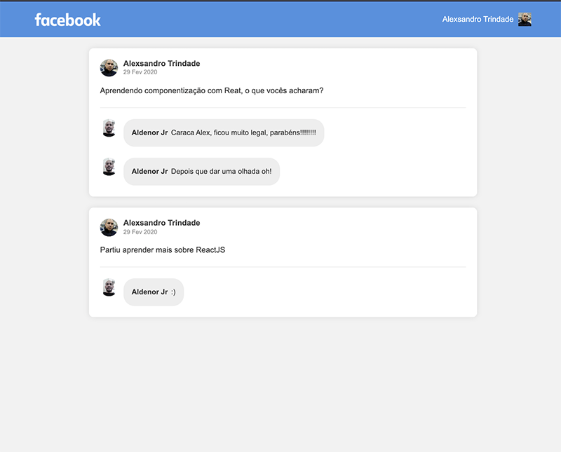
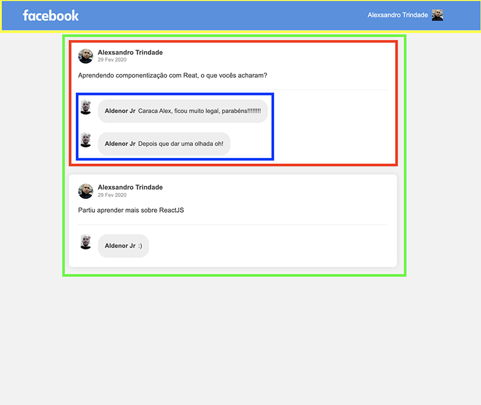

<h1 align="center">
    
</h1>

## Componentes usando ReactJS

Aplicação desenvolvida com o conceito de componentização utlizando as tecnologias: **Webpack, Babel, Webpack Dev Server e ReactJS**.

Nessa aplicação usamos os conceitos básicos de componentização para desenvolver uma **interface** semelhante com a do **Facebook** utilizando React.

### Tela da aplicação



### Componentes

Na imagem abaixo destaquei cada componente e abaixo da imagem está a descrição e responsabilidades de cada um:



**Header (Amarelo):** Responsável por exibir a logo e o link para acessar o perfil;

**PostList (Verde):** Responsável por armazenar os dados da listagem de post, segue o exemplo do código:

```js
class PostList extends Component {
  state = {
    posts: [
      {
        id: 1,
        author: {
          name: 'Alexsandro Trindade',
          avatar: 'https://avatars0.githubusercontent.com/u/18552211?s=460&v=4'
        },
        date: '29 Fev 2020',
        content: 'Aprendendo componentização com Reat, o que vocês acharam?',
        comments: [
          {
            id: 1,
            author: {
              name: 'Aldenor Jr',
              avatar: 'https://avatars3.githubusercontent.com/u/1765922?s=460&v=4'
            },
            date: '29 Fev 22020',
            content:
              'Caraca Alex, ficou muito legal, parabéns!!!!!!!!'
          },
        ]
      },
    ]
  };
}
```

**Post (Vermelho):** Responsável por exibir os dados do post, esses dados veem através de uma propriedade recebida do componente PostList:

```js
posts.map(post => <Post key={post.id} data={post} />);
```

**Comment (Azul):** Responsável por exibir um comentário. Os dados do comentário virão por uma propriedade do componente. Dentro do componente Post existe um novo `.map` para listar os comentários do post:

```js
data.comments.map(comment => <Comment key={comment.id} data={comment} />);
```

by Alexsandro Trindade :wave: [Visite meu GitHub!](https://github.com/sandrojsd)
